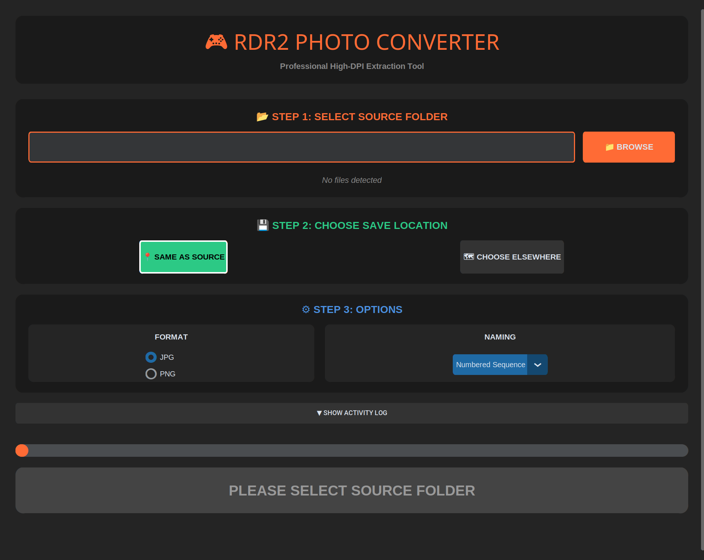

## 📸 Screenshot

## 📸 What This Tool Does

This is an **RDR2 photo converter** that lets you convert **Red Dead Redemption 2 photo mode files (PRDR)** into normal image formats.

Right now, you can convert photos into **two types**:
- **JPG**
- **PNG**

RDR2 does not store photos as normal images.  
Each PRDR file starts with around **300 bytes of junk / metadata** added by the game.  
After that offset, the actual image data begins.

What this tool does is simple:
- Skip the first **300 bytes**
- Read the real image data
- Save it as a usable JPG or PNG file

That’s why normal image viewers can’t open PRDR files directly, but this converter can.

---

## 🐧 Platform Notes

This app is mainly tested on **Linux**.

It *should* work on Windows and macOS, but I haven’t properly tested it there yet.  
If you try it on another OS and it works (or breaks), feel free to open an issue.
